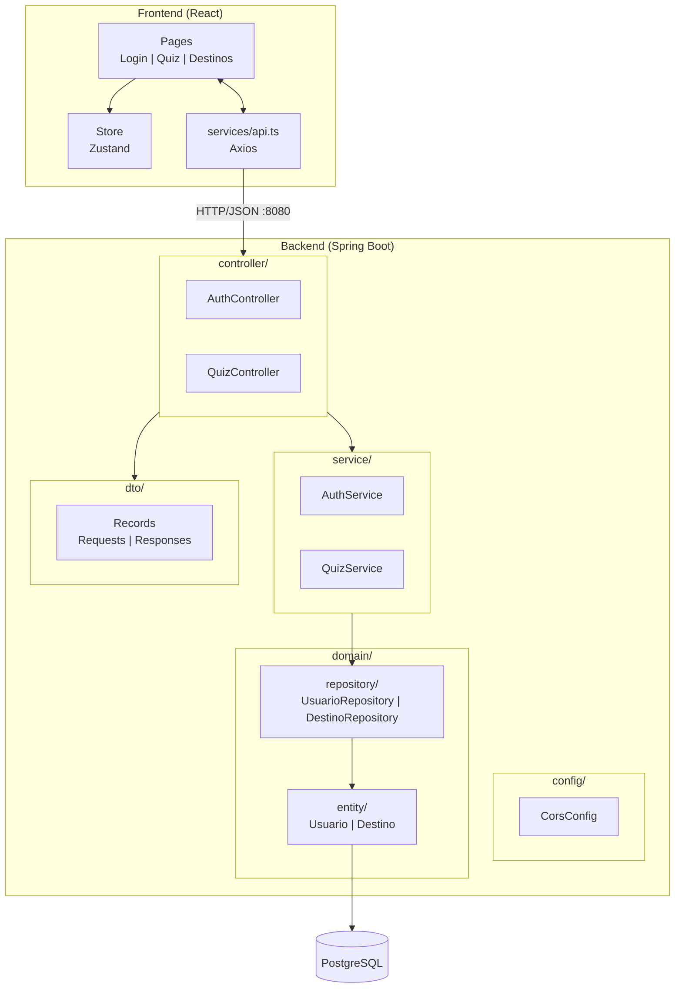
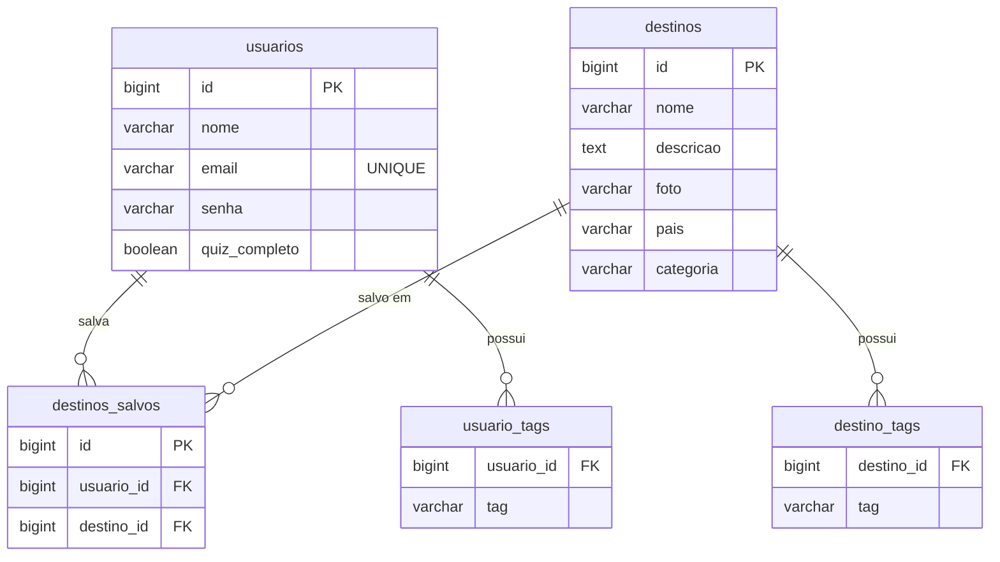
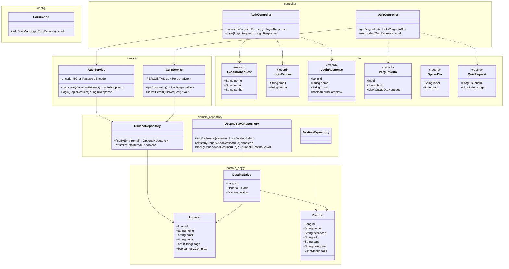
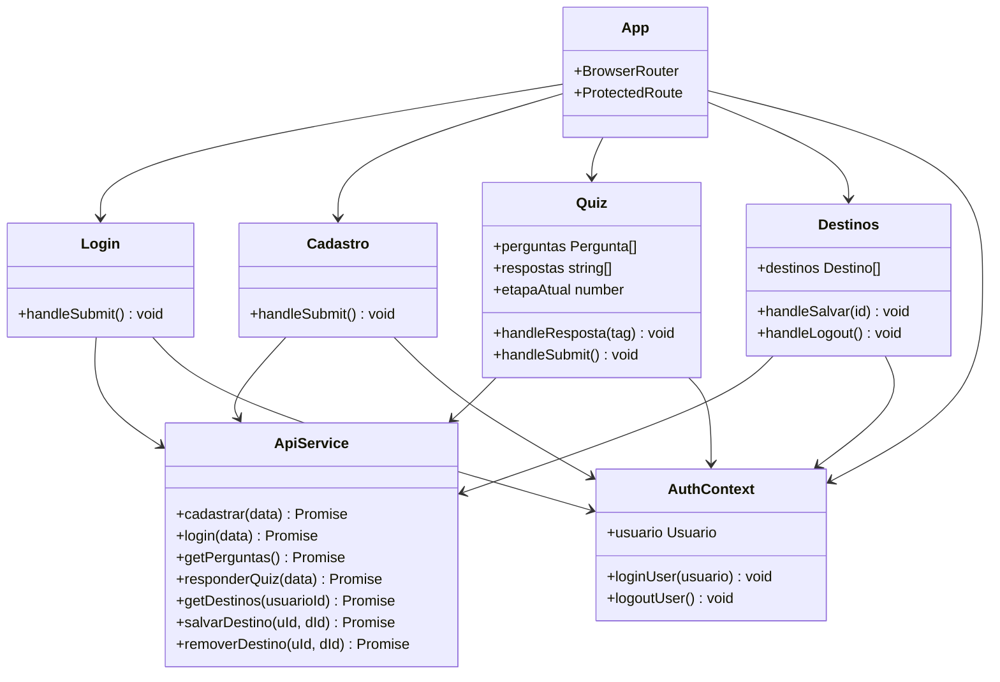
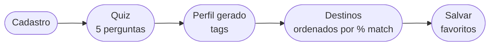

# SignatureTrips

Aplicativo de recomendação de viagens personalizado. O usuário se cadastra, responde um quiz de preferências de viagem, e recebe destinos recomendados com percentual de compatibilidade baseado no seu perfil.

---

## Stack Tecnológica

| Camada         | Tecnologia                      |
| -------------- | ------------------------------- |
| Frontend       | React 19.2 + TypeScript 6.0 + Vite 8.0 |
| Backend        | Spring Boot 4.0.5 + Java 21             |
| ORM            | Hibernate / Spring Data JPA             |
| Banco de Dados | PostgreSQL 16 (Docker)                  |
| Segurança      | BCrypt (spring-security-crypto)         |
| HTTP Client    | Axios                                   |
| Roteamento     | React Router DOM 7                      |

---

## Estrutura do Projeto

```
trips-signature/
├── backend/              # Spring Boot (Java 21, Maven)
│   ├── pom.xml
│   └── src/main/java/com/signaturetrips/api/
│       ├── config/       # CorsConfig
│       ├── controller/   # REST Controllers
│       ├── domain/
│       │   ├── entity/   # JPA Entities
│       │   └── repository/ # Spring Data Repositories
│       ├── dto/          # Records (Request/Response)
│       └── service/      # Business Logic
├── frontend/             # React 19 + TypeScript (Vite 8)
│   ├── package.json
│   └── src/
│       ├── pages/        # Route Components
│       ├── components/   # UI Components
│       ├── services/     # API Client
│       ├── store/        # State Management
│       └── types/        # TypeScript Interfaces
├── docker-compose.yml    # PostgreSQL 16
└── README.md
```

---

## Arquitetura



---

## Diagrama ER



> `usuario_tags` e `destino_tags` são tabelas auxiliares geradas automaticamente pelo `@ElementCollection` do JPA.

---

## Diagrama de Classes — Backend



---

## Diagrama de Classes — Frontend



---

## Fluxo do Usuário


