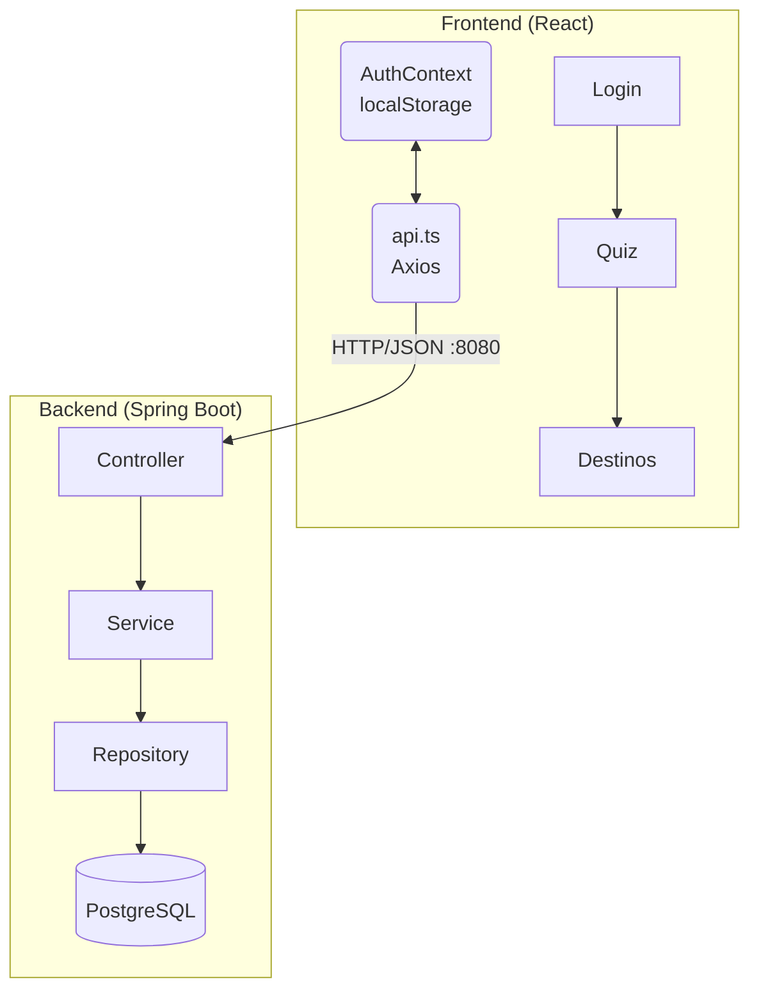
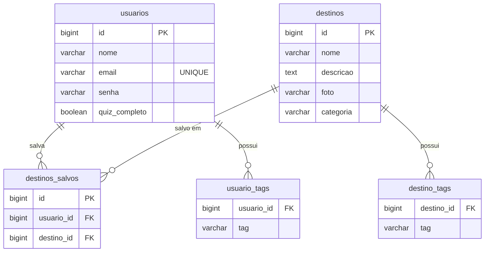
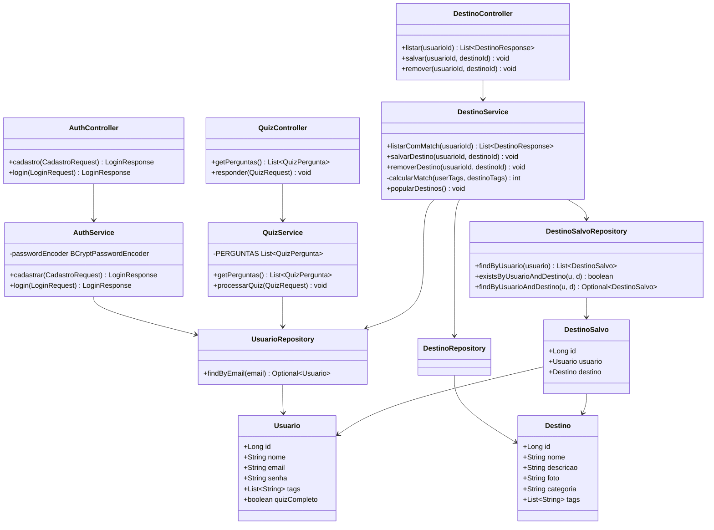
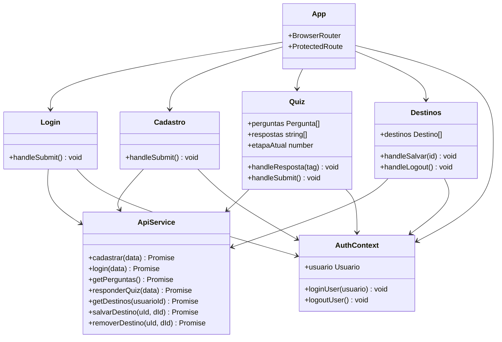
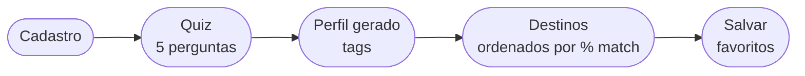

# SmartTour

Plataforma de tours virtuais com realidade aumentada. O usuário se cadastra, responde um quiz de preferências de viagem, e recebe destinos recomendados com percentual de compatibilidade baseado no seu perfil.

---

## Stack Tecnológica

| Camada         | Tecnologia                      |
| -------------- | ------------------------------- |
| Frontend       | React 19 + TypeScript + Vite 8  |
| Backend        | Spring Boot 4.0.5 + Java 21     |
| ORM            | Hibernate 7 / Spring Data JPA   |
| Banco de Dados | PostgreSQL 16 (Docker)          |
| Segurança      | BCrypt (spring-security-crypto) |
| HTTP Client    | Axios                           |
| Roteamento     | React Router DOM 7              |

---

## Estrutura do Projeto

```
tour_smart/
├── frontend/          # React + TypeScript (Vite)
├── backend/           # Spring Boot (Java 21, Maven)
├── docker-compose.yml # PostgreSQL 16
├── README.md
└── REQUIREMENTS.md    # User stories e requisitos do projeto
```

---

## Arquitetura



---

## Diagrama ER



> `usuario_tags` e `destino_tags` são tabelas auxiliares geradas automaticamente pelo `@ElementCollection` do JPA.

---

## Diagrama de Classes — Backend



---

## Diagrama de Classes — Frontend



---

## Fluxo do Usuário


